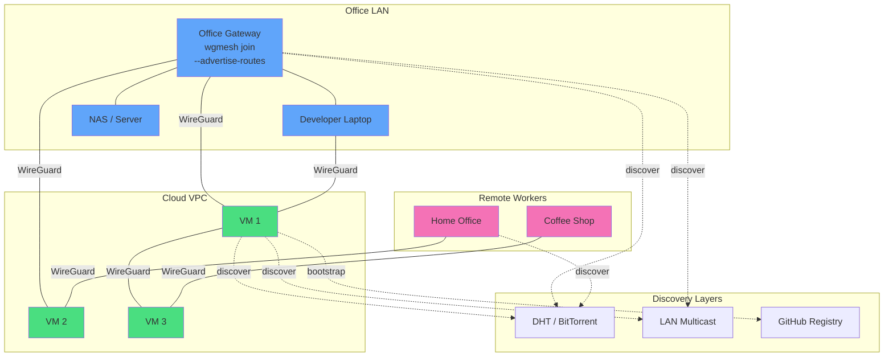

# Self-Hosted VPN for DevOps Teams

**Build encrypted mesh networks in minutes, not hours.** Generate a shared secret, run `wgmesh join` on each node, and let DHT discovery wire everything together — NAT traversal, endpoint detection, and route management included.

[**Get Started**](../docs/quickstart.md) · [**View on GitHub**](https://github.com/atvirokodosprendimai/wgmesh) · [**Read Docs**](../docs/)

---

## Why wgmesh?

Running a self-hosted VPN shouldn't require a coordination server, monthly subscription fees, or manual configuration juggling. wgmesh gives you:

- **Zero SaaS dependency** — No control plane to host, no accounts to create, no per-seat pricing
- **Decentralized discovery** — Nodes find each other via DHT using a shared secret
- **WireGuard-native** — Uses the WireGuard kernel module for maximum performance
- **Works anywhere** — Handles NAT traversal, dynamic IPs, and multi-cloud networks
- **DevOps-friendly** — Deploy via SSH, integrate with CI/CD, monitor with Prometheus

---

## One-Line Install

```bash
# Generate a mesh secret (once)
wgmesh init --secret

# On every node — same secret, automatic discovery
wgmesh join --secret "wgmesh://v1/<your-secret>"
```

That's it. Nodes discover each other, establish WireGuard tunnels, and maintain the mesh automatically.

**[Full Quickstart Guide →](../docs/quickstart.md)**

---

## Key Differentiators

| Feature | wgmesh | Tailscale | ZeroTier | Netmaker | Raw WireGuard |
|---------|--------|-----------|----------|----------|---------------|
| **Self-hosted, no SaaS** | ✅ DHT-based, no server | ❌ Control plane required | ❌ Cloud coordination | ❌ Server required | ✅ Full control |
| **Decentralized discovery** | ✅ DHT + LAN multicast | ❌ Central server | ❌ Central server | ❌ Server required | ❌ Manual config |
| **WireGuard-native** | ✅ Kernel module | ✅ WireGuard | ❌ Custom protocol | ✅ WireGuard | ✅ WireGuard |
| **NAT traversal** | ✅ UDP hole-punching | ✅ NAT traversal | ✅ NAT traversal | ⚠️ Limited | ❌ Manual setup |
| **Open source & auditable** | ✅ MIT License | ❌ Proprietary | ⚠️ Mixed license | ✅ GPL | ✅ Public domain |
| **Shared secret access** | ✅ One secret for all nodes | ❌ ACL/invite system | ❌ Per-node tokens | ❌ Per-node tokens | ❌ Manual keys |
| **macOS + Linux** | ✅ | ✅ | ✅ | ✅ | ✅ |
| **Windows support** | ❌ (planned) | ✅ | ✅ | ✅ | ✅ |
| **SSH fleet management** | ✅ Centralized mode | ❌ | ❌ | ❌ | ❌ Manual |
| **Route propagation** | ✅ Auto-advertise | ✅ | ✅ | ✅ | ❌ Manual |
| **Monthly cost** | $0 | Free tier, then paid | Free tier, then paid | Self-hosted cost | $0 |

---

## Use Cases

### Remote Team Access

Give every developer a persistent mesh IP to internal services — databases, staging environments, code-review tools. New team members join by receiving the secret. No VPN server, no static IP required.

**Problem solved:** Key distribution becomes "share this secret" instead of updating every peer config when someone joins or leaves.

**[Remote Dev Team Guide →](../docs/use-cases/remote-dev-team.md)**

### Fleet Management

Manage WireGuard across your server fleet from a single control node via SSH. Topology lives in a state file; changes are deployed with diff-based updates (no interface restarts).

**Problem solved:** Centralized control without a coordination server. Update 100 nodes in seconds with `wgmesh -deploy`.

**[Managed Fleet Guide →](../docs/use-cases/managed-fleet.md)**

### Multi-Cloud Networking

Connect VMs across AWS, GCP, and Hetzner into a single private network. No cloud-specific VPN gateways, no BGP configuration. Each VM joins with the same command.

**Problem solved:** Eliminate $75–150/month in VPN gateway fees. Add new regions by running `wgmesh join` on one new VM.

**[Multi-Cloud Guide →](../docs/use-cases/multi-cloud.md)**

### Site-to-Site Connectivity

Connect your office LAN to cloud VPCs without a static IP. The office gateway advertises its subnet; cloud VMs automatically install routes. ISP IP changes? DHT re-announces automatically.

**Problem solved:** No DDNS, no manual route updates. Dynamic IP is handled by the mesh.

**[Site-to-Site Guide →](../docs/use-cases/hybrid-site-to-site.md)**

---

## How It Works

### Decentralized Mode (Secret-Based Discovery)

1. **Generate a secret** with `wgmesh init --secret` — this is the only coordination primitive
2. **Derive mesh parameters** via HKDF-SHA256: subnet, encryption keys, discovery channels
3. **Nodes announce** on DHT, LAN multicast, and GitHub Issues registry (three layers for redundancy)
4. **WireGuard tunnels** establish automatically with NAT traversal
5. **Route propagation** happens via `--advertise-routes` for site-to-site scenarios

```
node1 <----> node2
  ^            ^
  | (DHT + LAN)| 
  v            v
node3 <----> node4
```

### Centralized Mode (SSH Deployment)

1. **Initialize state** with `wgmesh -init` on the control node
2. **Add nodes** with `wgmesh -add hostname:mesh_ip:ssh_host`
3. **Deploy configs** with `wgmesh -deploy` — SSH diff-based WireGuard updates
4. **Change topology** by editing the state file and re-running deploy

**[Centralized Mode Reference →](../docs/centralized-mode.md)**

---

## Security Model

wgmesh uses a **secret-derived identity** model:

- **HKDF-SHA256 key derivation** — Every mesh parameter comes from your shared secret
- **WireGuard end-to-end encryption** — AES-256-GCM between all peers
- **No central server to compromise** — DHT is public; only secret-holders can join
- **Deterministic addressing** — Same secret always produces the same mesh IPs
- **Optional state encryption** — Centralized mode supports AES-256-GCM at rest

**[Encryption Details →](../ENCRYPTION.md)**

---

## Migration Paths

### From Tailscale

| Tailscale Concept | wgmesh Equivalent |
|-------------------|-------------------|
| Tailscale coordination server | DHT + LAN multicast (no server) |
| ACL files | Centralized mode policy engine |
| `tailscale up` | `wgmesh join --secret "..."` |
| `tailscale status` | `wgmesh peers list` |
| Tailscale SSH | WireGuard + your existing SSH |

**Key difference:** No accounts, no web dashboard, no OAuth. Just a shared secret.

### From ZeroTier

| ZeroTier Concept | wgmesh Equivalent |
|-------------------|-------------------|
| ZeroTier cloud controller | DHT + GitHub Issues registry |
| Network ID | Derived from secret (HKDF) |
| `zerotier-cli join` | `wgmesh join --secret "..."` |
| Flow rules | Centralized mode policy engine |

**Key difference:** ZeroTier uses a custom protocol; wgmesh uses native WireGuard.

### From Manual WireGuard

| Manual WireGuard | wgmesh |
|------------------|--------|
| Editing `wg0.conf` on every node | Single `wgmesh join` command |
| Tracking public keys across nodes | Automatic key exchange via DHT |
| Endpoint management | NAT traversal + auto-discovery |
| Route updates | `--advertise-routes` auto-propagation |

**Key difference:** wgmesh handles the operational toil of key distribution and endpoint tracking.

---

## Technical Specs

### Performance

- **Throughput:** WireGuard-native speeds (940+ Mbit/s on t3.micro)
- **Latency overhead:** < 1 ms additional vs. raw WireGuard
- **NAT traversal:** ~85% success rate for typical home/office NAT
- **Mesh size:** Tested up to 50 nodes; scales to 200+ nodes

### Requirements

- **OS:** Linux kernel ≥ 5.6 (WireGuard built-in) or macOS with `wireguard-go`
- **Tools:** `wireguard-tools` (`wg` command)
- **Network:** Outbound UDP for DHT; at least one node reachable or NAT traversal acceptable
- **Access:** Root or `CAP_NET_ADMIN` capability

### Protocols & Technologies

- **WireGuard:** Kernel-based VPN (Linux 5.6+)
- **DHT:** BitTorrent Mainline DHT for peer discovery
- **LAN multicast:** Local network instant discovery
- **GitHub Issues:** Bootstrap registry fallback
- **In-mesh gossip:** UDP broadcast for rapid updates
- **Encryption:** HKDF-SHA256, AES-256-GCM, HMAC membership proofs

---

## Production Evaluation

**Before rolling out to production**, use the [15-minute evaluation checklist](../docs/evaluation-checklist.md) to confirm:

- ✅ Infrastructure requirements (kernel, network, storage)
- ✅ Use case fit (decentralized vs. centralized mode)
- ✅ wgmesh vs. alternatives comparison
- ✅ Pilot test scenarios (basic mesh, NAT traversal, subnet routing)
- ✅ 30-day structured pilot (optional, recommended)

**[Evaluation Checklist →](../docs/evaluation-checklist.md)**

**[Pilot Evaluation Guide →](../docs/pilot-evaluation-guide.md)**

---

## Common Questions

### Do I need a public IP?

**No.** At least one node in the mesh should have a public IP OR you need NAT traversal (UDP hole-punching) to be acceptable. If all nodes are behind symmetric NAT, the mesh will fall back to relay paths (still functional, slightly higher latency).

### How do secrets work?

The secret is a passphrase that derives all mesh parameters via HKDF-SHA256: network ID, subnet, encryption keys, discovery channels. Different secrets = completely separate meshes.

**[FAQ: How do mesh secrets work? →](../docs/FAQ.md#how-do-mesh-secrets-work)**

### Is this secure?

Yes. WireGuard provides end-to-end encryption. The secret is never transmitted — only derived identifiers are used for discovery. State files can be encrypted at rest with AES-256-GCM.

**[Encryption Documentation →](../ENCRYPTION.md)**

### What's the difference between modes?

- **Decentralized:** Nodes self-join and self-manage using a shared secret
- **Centralized:** Operator controls topology from a single state file via SSH

Both modes use the same WireGuard backend and support NAT traversal + route propagation.

### Can I use this with Kubernetes?

Yes. Deploy wgmesh as a DaemonSet with `hostNetwork: true` and `securityContext.capabilities.add: ["NET_ADMIN"]`. Each pod gets a mesh IP; pods can discover each other via DHT.

### How do I monitor the mesh?

Enable Prometheus metrics with `--metrics :9090`. Available metrics include peer counts, NAT type, discovery events, reconcile duration, and Go runtime stats.

**[Metrics Reference →](../README.md#metrics)**

---

## Get Started

### Option A: Quick Test (2 nodes, 5 minutes)

```bash
# Terminal 1: Generate secret
wgmesh init --secret

# Terminal 1: Start first node
sudo wgmesh join --secret "wgmesh://v1/<your-secret>"

# Terminal 2: Start second node (same secret)
sudo wgmesh join --secret "wgmesh://v1/<your-secret>"

# Terminal 1 or 2: Verify peers
wgmesh peers list
```

### Option B: Production Deployment

1. **Read the [Quickstart Guide](../docs/quickstart.md)** — All installation methods, troubleshooting, and verification steps
2. **Choose a use case** — [Use case guides](../docs/use-cases/README.md) for remote teams, fleets, multi-cloud, or site-to-site
3. **Run the [evaluation checklist](../docs/evaluation-checklist.md)** — Confirm wgmesh fits your infrastructure
4. **Deploy a pilot** — Optional 30-day structured pilot with automated milestones

---

## Community & Support

- **GitHub Issues:** [Bug reports and feature requests](https://github.com/atvirokodosprendimai/wgmesh/issues)
- **Documentation:** [Full docs index](../docs/)
- **Contributing:** [CONTRIBUTING.md](../CONTRIBUTING.md)

---

## License

MIT License — see [LICENSE](../LICENSE) file for details.

---

**Ready to deploy? [Start the quickstart →](../docs/quickstart.md)**

---

## Architecture Diagram



---

## Comparison: When to Use wgmesh

| Use Case | Recommended Tool | Why |
|----------|------------------|-----|
| Small team (< 10), remote access | **wgmesh** or Tailscale | wgmesh: no SaaS, shared secret; Tailscale: easier ACL management |
| Fleet of servers (50+) | **wgmesh** (centralized mode) | SSH-based deployment, no coordination server overhead |
| Multi-cloud VPCs | **wgmesh** | No VPN gateway fees, WireGuard-native performance |
| Windows + macOS + Linux | **Tailscale** or ZeroTier | wgmesh lacks Windows support |
| Strict compliance, auditable | **wgmesh** or manual WireGuard | Open source, self-hosted, no proprietary control plane |
| Developer experience, ease of use | **Tailscale** | Web UI, OAuth, excellent UX |
| Data sovereignty, no cloud | **wgmesh** | Fully decentralized, DHT-based |
| CI/CD integration | **wgmesh** (centralized mode) | State file in Git, deploy via SSH |

---

## Next Steps

1. **[Quickstart Guide](../docs/quickstart.md)** — Step-by-step from install to verified mesh
2. **[Use Case Guides](../docs/use-cases/README.md)** — Real-world deployment patterns
3. **[Evaluation Checklist](../docs/evaluation-checklist.md)** — Production readiness assessment
4. **[FAQ](../docs/FAQ.md)** — Technical details on secrets, interfaces, and behavior
5. **[GitHub Repository](https://github.com/atvirokodosprendimai/wgmesh)** — Source code, issues, and releases

---

**wgmesh — Self-hosted mesh VPN for DevOps teams who value control, performance, and simplicity.**

[**Deploy Your First Mesh →**](../docs/quickstart.md)
